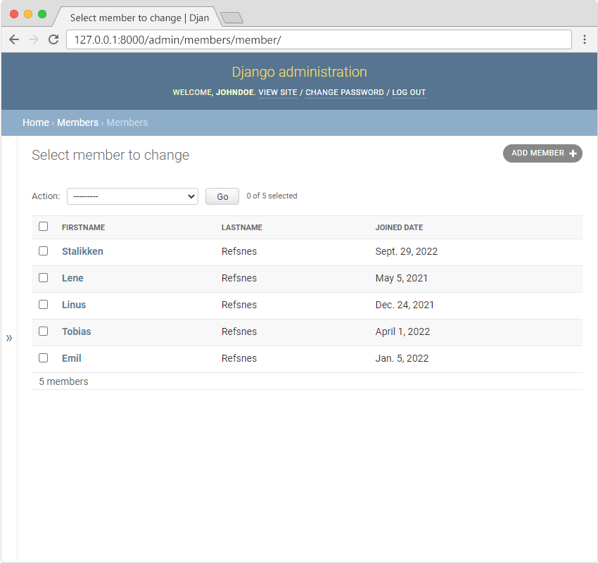

# My Tennis Club - Add Members

This guide explains how to populate the "My Tennis Club" project with members after migrating to a new PostgreSQL database.

---

## Overview

After setting up a new PostgreSQL database, the "My Tennis Club" project is empty. To restore the members list, you need to add the members manually through the admin interface. The previous SQLite database contained 5 members, which you can re-add in this process.

---

## Steps to clone this project will be updated soon...
